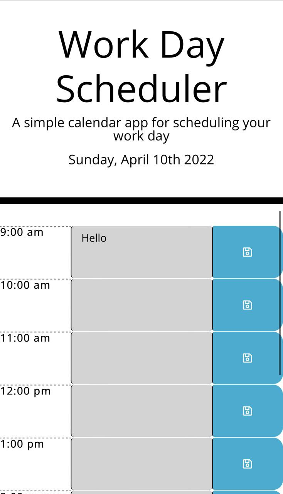

# Stepan Matysik's Work Day Scheduler
> Work Day Scheduler project. A website with a schedule of the day.
> Live demo [_here_](https://elfsvet.github.io/stepan-matysik-work-day-scheduler/). 

## Table of contents
* [General info](#general-info)
* [Build with](#build-with)
* [Setup](#setup)
* [Features](#features)
* [Screenshots](#screenshots)
* [Usage](#usage)
* [Project Status](#project-status)
* [Room for Improvement](#room-for-improvement)
* [Acknowledgements](#acknowledgements)
* [Contacts](#contact)


## General Info
This is a basic day planner app that loops through the hours of 9am - 5pm(typical working hours) for a specific date, which is the current day that the user opens the app. The app uses moment.js to handle time. The app also allows the user to enter and save text into any task area. The data will be saved to the localStorage of the browser. The past hours are highlighted gray, the current hour red, and future hours green.


## Build With
Project is created with:
- HTML
- CSS
- JavaScript
- jQuery
- jQuery UI
- Bootstrap
- Moment.js

## Setup
To open this project in vscode using git in Terminal/Git Bash:

```bash 
$ cd <to the directory you would like to store the project>
$ git clone https://github.com/elfsvet/stepan-matysik-work-day-scheduler.git
$ code .
```

## Features
- Mobile Compatibility
- Fast Load Times
- Browser Consistency

## Screenshots



## Usage
To keep up with you daily work routine.

## Project Status
Project is: _complete_

## Room for Improvement
To do:
- Can have highlight text then clicked in a text area.
- Can add a button to clean the schedule or clean a hour line

## Acknowledgements
- This project was inspired by UM Coding Boot Camp
- This project was creating from the [provided code](https://github.com/coding-boot-camp/super-disco).

## Contact
Created by [@elfsvet](https://github.com/elfsvet)
- [LinkedIn](https://www.linkedin.com/in/stepanmatysik/)